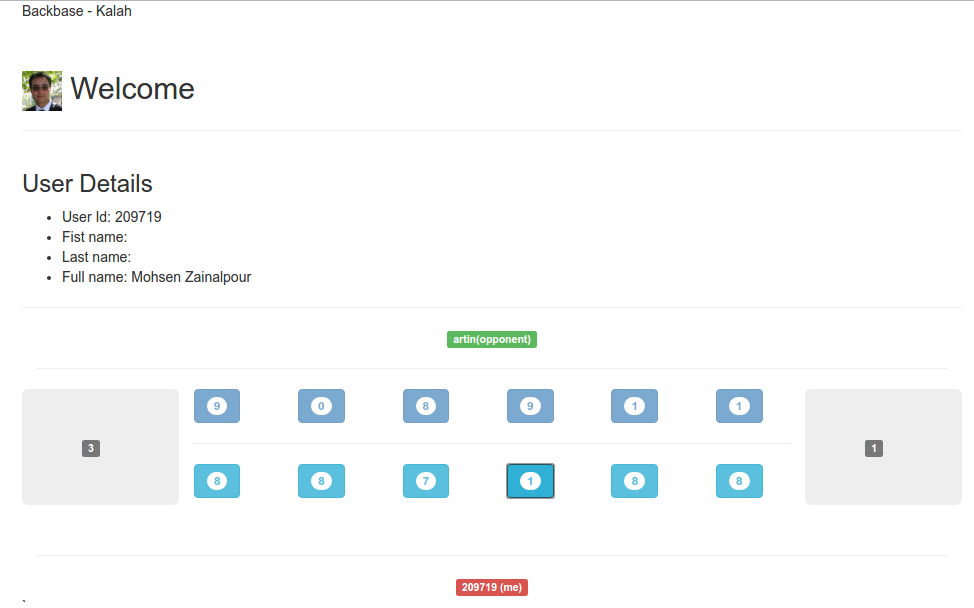

Kalah (Mancala)
=================================

This is a simple web application to let players play an online Kalah game with each other.

Kalah Game: 

## How to Setup
From the project folder run bellow command to download all the required dependencies and run the project:

```bash
./activator run
```

After everything is done, open a browser and browse <a href="http://localhost:9000">http://localhost:9000</a>. You can use an another browser to represent 
a different user or use the <a href="https://github.com/cyberixae/dwst">Dark WebSocket Terminal</a> as a separate WebSocket client to send raw WebSocket commands.      

## How to play
Each of the two players has six pits in front of him/her. To the right of the six pits, each player has a larger pit, his Kalah or house. At the start of the game, six stones are put In each pit.
The player who begins picks up all the stones in any of their own pits, and sows the stones on to the right, one in each of the following pits, including his own Kalah. No stones are put in the opponent's' Kalah. If the players last stone lands in his own Kalah, he gets another turn. This can be repeated any number of times before it's the other player's turn.
when the last stone lands in an own empty pit, the player captures this stone and all stones in the opposite pit (the other players' pit) and puts them in his own Kalah.
The game is over as soon as one of the sides run out of stones. The player who still has stones in his/her pits keeps them and puts them in his/hers Kalah. The winner of the game is the player who has the most stones in his Kalah.
    
## Sample WebSocket Requests

### connect
```javascript
/connect ws://localhost:9000/ws/player/<PlayerName>
```

### disconnect
```javascript
/disconnect
```

### Player List Request
```javascript
{"type":"players-request"}
```

### Game request
```javascript
{"type":"game-request", "opponent-player": "player-artin"}
```

### Want to play response
```javascript
{"type":"want-to-play-response", "current-player" : "player-artin" , "opponentPlayer":"player-mohsen" , "response": "ACCEPT"}
```

### Move
```javascript
{"type":"move", "player" : "player-mohsen" , "pit-index":"1" }
```
